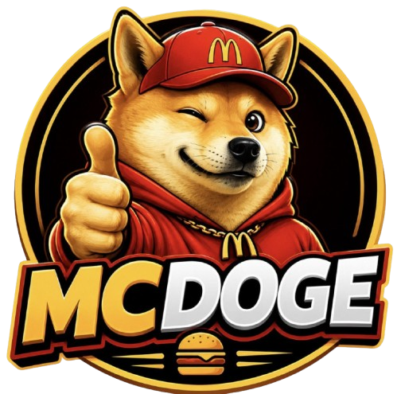
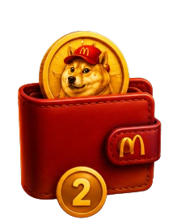
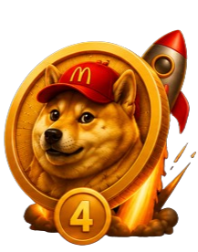

# 🍔 MCDOGE — The Happiest Restaurant in Crypto 🐶

[](https://solana.com)
[](https://nextjs.org/)
[](https://react.dev/)
[](https://www.typescriptlang.org/)
[](https://opensource.org/licenses/MIT)

Welcome to **MCDOGE**, the happiest restaurant in crypto. Inspired by the legendary **McDonald's x Dogecoin** narrative, MCDOGE is a community-driven restaurant concept on Solana serving original characters, daily animated episodes, fresh memes, and a community where everyone has a seat at the table.

<div align="center">
  
  <h3>"This isn't just another meme coin. Welcome home. Grab a seat."</h3>
</div>

---

## 📖 Table of Contents

- [🚀 Live Links](#-live-links)
- [✨ Key Features](#-key-features)
- [📊 Tokenomics](#-tokenomics)
- [🛍️ How to Buy Guide](#️-how-to-buy-guide)
- [🛠️ Tech Stack & Info](#️-tech-stack--info)
- [📂 Repository Structure](#-repository-structure)
- [⚙️ Getting Started & Installation](#️-getting-started--installation)
- [🗺️ Roadmap](#️-roadmap)

---

## 🚀 Live Links

| Platform | Link |
| :--- | :--- |
| **📈 Live Chart** | [DexScreener Chart](https://dexscreener.com/solana/9zmuy8rslo4pjtcmnvccag5m2adfnnwlsgaqzkvqhpdz) |
| **🐦 X / Twitter** | [@mcdogecryprest](https://x.com/mcdogecryprest) |
| **💬 Telegram** | [Join official Crew Chatroom](https://t.me/ysctop) |
| **📝 Smart Contract (Solana)** | `9fQdMbjsYg7vNjnXULwzdmoCS4napNoWya5Zf7YAfhaa` |

---

## ✨ Key Features

This frontend is designed to **wow** users at first sight, implementing high-end interaction design and animations:

- **🎭 Interactive Canvas Morphing**: Custom canvas-based typography icons that dynamically morph between McDonald's / Solana themed SVGs and letters (`M-C-D-O-G-E`) on hover.
  - **M**: The Happiest Restaurant (Serving smiles and joy daily)
  - **C**: Original Characters (Meet our custom-designed kitchen crew)
  - **D**: Daily Episodes (Watch the kitchen drama and comedy unfold)
  - **O**: Fresh Memes (Cooked up fresh in our Web3 kitchen)
  - **G**: A Seat at the Table (Inclusive community with zero hierarchy)
  - **E**: Welcome Home (Every builder, driver, and guest matters)
- **🌀 Smooth Scrolling**: Integrated with **Lenis** smooth scroll for ultra-fluid viewport traversal.
- **⚡ GSAP & Framer Motion Orchestration**: Seamless micro-interactions, page scroll-reveal animations, and stagger effects.
- **🌌 Ambient Particle Canvas**: A lightweight canvas particle background that reacts dynamically to the user's cursor.
- **🎯 Custom Cursor**: A branded cursor tracking user movement with magnetic attractions to key buttons.
- **📱 Fluid WebM Accordion Roadmap**: Full-screen interactive roadmap panels shifting layouts smoothly with embedded background loops.
- **🎫 CA One-Click Copy Bar**: Convenient smart contract address copy container with instant visual copy feedback.

---

## 📊 Tokenomics

MCDOGE operates on a transparent and safe token model with **1,000,000,000 (1 Billion) total supply** of `$MCDOGE`.

<div align="center">
  <table>
    <thead>
      <tr>
        <th>Allocation Sector</th>
        <th>Percentage</th>
        <th>Color Indicator</th>
        <th>Description</th>
      </tr>
    </thead>
    <tbody>
      <tr>
        <td><strong>Liquidity Pool (LP)</strong></td>
        <td>80%</td>
        <td>🟢 Green</td>
        <td>Locked and burned permanently. Safe kitchen, clean cooking, zero rug risk.</td>
      </tr>
      <tr>
        <td><strong>Marketing &amp; Franchising</strong></td>
        <td>10%</td>
        <td>🟠 Orange</td>
        <td>Reserved for tier-1 exchange integrations, animated episodes, and global campaigns.</td>
      </tr>
      <tr>
        <td><strong>Customer Rewards &amp; Airdrops</strong></td>
        <td>5%</td>
        <td>🟡 Yellow</td>
        <td>Distributed back to our most active guests, contributors, and loyal family.</td>
      </tr>
      <tr>
        <td><strong>Kitchen Dev &amp; Expansion</strong></td>
        <td>5%</td>
        <td>🟣 Purple</td>
        <td>Allocated for technical scaling, character design, and restaurant franchise expansion.</td>
      </tr>
    </tbody>
  </table>
</div>

---

## 🛍️ How to Buy Guide

Ordering a fresh bag of `$MCDOGE` is simple:

<div align="center">
  <table style="border: none;">
    <tr>
      <td width="25%" align="center">
        <br/>
        <strong>1. Get Wallet Ready</strong><br/>
        <small>Download Phantom or your wallet of choice for free from the App Store or Google Play Store. Setup your seed phrase.</small>
      </td>
      <td width="25%" align="center">
        <br/>
        <strong>2. Load Up on SOL</strong><br/>
        <small>Buy Solana (SOL) inside Phantom, or deposit from an exchange (Binance, Coinbase, Kraken, etc.) to pay for kitchen orders.</small>
      </td>
      <td width="25%" align="center">
        <br/>
        <strong>3. Visit the Kitchen</strong><br/>
        <small>Head to Jupiter (jup.ag) or Raydium.io via your wallet's built-in browser. Paste the official $MCDOGE address to load the recipe.</small>
      </td>
      <td width="25%" align="center">
        <br/>
        <strong>4. Order your $MCDOGE</strong><br/>
        <small>Confirm details, set slippage to Auto/1%, and swap your SOL. Welcome to the happiest restaurant in crypto!</small>
      </td>
    </tr>
  </table>
</div>

### Official Contract Address (CA):
```text
9fQdMbjsYg7vNjnXULwzdmoCS4napNoWya5Zf7YAfhaa
```

---

## 🛠️ Tech Stack & Info

MCDOGE is powered by a modern, ultra-responsive web development stack:

- **Framework**: [Next.js 16.2.10](https://nextjs.org/) (App Router, Server-side metadata optimization)
- **Runtime Library**: [React 19.2.4](https://react.dev/)
- **Programming Language**: [TypeScript](https://www.typescriptlang.org/)
- **Animation Orchestrators**:
  - [GSAP 3.15.0](https://gsap.com/) & [ScrollTrigger](https://gsap.com/docs/v3/Plugins/ScrollTrigger/) (for advanced timelines and chart scroll triggers)
  - [Framer Motion 12.4.2](https://www.framer.com/motion/) (for spring dynamics, transitions, and state changes)
- **Scroller**: [Lenis 1.3.25](https://lenis.darkroom.engineering/) (for unified, momentum-based scrolling across devices)
- **Icons**: [Lucide React](https://lucide.dev/) (for clean, lightweight vector assets)
- **Styling**: Vanilla CSS (modularized stylesheet utilizing CSS Variables/Design Tokens, combined with Next.js `styled-jsx` for page-specific component scoping)

---

## 📂 Repository Structure

The layout of the codebase is modular, prioritizing clean separation of visual sections and animation logics:

```text
mcgoogles-empty/
├── public/                     # Static media assets
│   ├── Roadmap/                # WebM videos for Roadmap phases
│   ├── logo.png                # Primary token logo
│   ├── mcdelivery.webm         # Hero section/about full bleed video loop
│   └── roadmap1-4.png          # Step-by-step How-to-Buy illustrations
├── src/
│   ├── app/                    # Next.js page structure & setup
│   │   ├── globals.css         # Typography, design tokens & reset
│   │   ├── layout.tsx          # Root layout, Google Fonts config, SEO meta
│   │   └── page.tsx            # Orchestrator page putting components together
│   └── components/             # Reusable UI Section components
│       ├── AboutSection.tsx    # Features grid with canvas morph logic
│       ├── ChartSection.tsx    # Responsive live chart embedding
│       ├── CustomCursor.tsx    # Magnetic mouse cursor tracking
│       ├── Footer.tsx          # End-page footer
│       ├── HowToBuySection.tsx # Spotlights + contract copy logic
│       ├── Navbar.tsx          # Sticky responsive header navigation
│       ├── RoadmapSection.tsx  # Expanding WebM accordion panel roadmap
│       ├── SmoothScroll.tsx    # Lenis configuration setup
│       ├── SocialsSection.tsx  # Links cards grid and loop video
│       └── Tokenomics.tsx      # SVG interactive donut chart + allocation list
├── tsconfig.json               # TypeScript compiler options
├── package.json                # Project scripts and dependencies
└── next.config.ts              # Next.js configurations
```

---

## ⚙️ Getting Started & Installation

To run this project locally, follow these steps:

### 1. Clone the repository
```bash
git clone <repository-url>
cd mcgoogles-empty
```

### 2. Install dependencies
Ensure you have [Node.js](https://nodejs.org/) installed (v18+ recommended).
```bash
npm install
```

### 3. Start the local development server
```bash
npm run dev
```
Open [http://localhost:3000](http://localhost:3000) in your browser to view the interactive experience.

### 4. Build for Production
To compile and optimize the app for production:
```bash
npm run build
npm run start
```

---

## 🗺️ Roadmap

- **Phase 1: Order Up! 🍔**
  - Fair launch on Solana with 100% burned LP.
  - DEX listings & verification (DexScreener, DEXTools, Solscan).
  - Kitchen preparations: Launching original characters and social portals.
  - Welcoming the first 1,000+ guests to their seats.

- **Phase 2: Kitchen Expansion 🚀**
  - Strategic marketing integrations & aggressive publicity loops.
  - CoinGecko and CoinMarketCap listings.
  - Debut of daily animated episodes and custom character memes.
  - Filling the dining room: Reaching 5,000+ active table guests.

- **Phase 3: Franchising the Brand 📈**
  - First wave of Centralized Exchange (CEX) listings.
  - Real-world community campaigns with official MCDOGE restaurant merch.
  - Custom NFT membership passes representing the MCDOGE kitchen crew.
  - Growing our global family to 15,000+ active seats at the table.

- **Phase 4: Global Franchise Domination 🌕**
  - Mainstream animated episodes and narrative takeover.
  - Integrating MCDOGE into crypto payment gateways for food & beverages.
  - Tier 1 Centralized Exchange integrations.
  - Spreading financial freedom smiles to dining rooms worldwide.

---

<div align="center">
  <p>Created with 💛 by the MCDOGE Dev Team. All rights reserved.</p>
</div>
